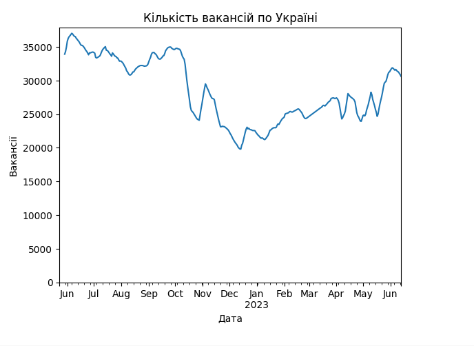
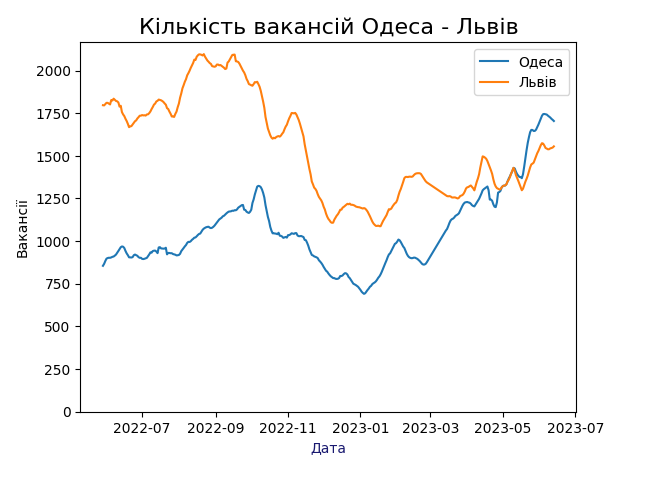

# Data Analytics with Python

This repository contains Python code for performing data analytics using various libraries. The analysis includes fetching data, data preparation, visualization, and comparisons of job vacancies in different cities of Ukraine.

## Getting Started

These instructions will help you get a copy of the project up and running on your local machine for development and testing purposes.

1. Clone the repository to your local machine:

git clone https://github.com/valeriorichi/Python-for-analytics.git

2. Install the required Python libraries if you haven't already. You can use `pip`:

pip install requests pandas numpy matplotlib

3. Run the Python scripts to perform the analysis. Each script corresponds to a specific task, such as fetching data, data preparation, and plotting.

## Data Sources

The data used in this analysis is retrieved from the following source:
- [UaData.net](https://uadata.net/work-positions/cities.json)

## Code Structure

- `fetch_data.py`: Fetches job vacancy data from the data source and stores it in a DataFrame.
- `data_preparation.py`: Prepares the data for analysis, including data cleaning and interpolation.
- `plotting.py`: Generates various plots to visualize job vacancy trends.

## Analysis

### Job Vacancy Trends in Ukraine

This plot shows the trend of job vacancies in Ukraine over time. It includes data cleaning and interpolation to handle missing values.

### Job Vacancy Trends in Different Cities

This plot compares job vacancy trends in Odessa and Lviv, highlighting the 7-day rolling average.

### Homework: Job Vacancy Trends in Ternopil and Lviv

This plot compares job vacancy trends in Ternopil and Lviv, highlighting the 7-day rolling average. (Add this section if you want to include the additional analysis)

## Authors

- Valeriy Yuriy

## License

This project is licensed under the MIT License - see the [LICENSE.md](LICENSE.md) file for details.

## Acknowledgments

- Mention any acknowledgments or data sources here.

Feel free to enhance this README with additional sections, explanations, or images to provide a comprehensive overview of your project. Make sure to replace placeholders like `your-username` and `your-repository` with your actual GitHub username and repository name.
